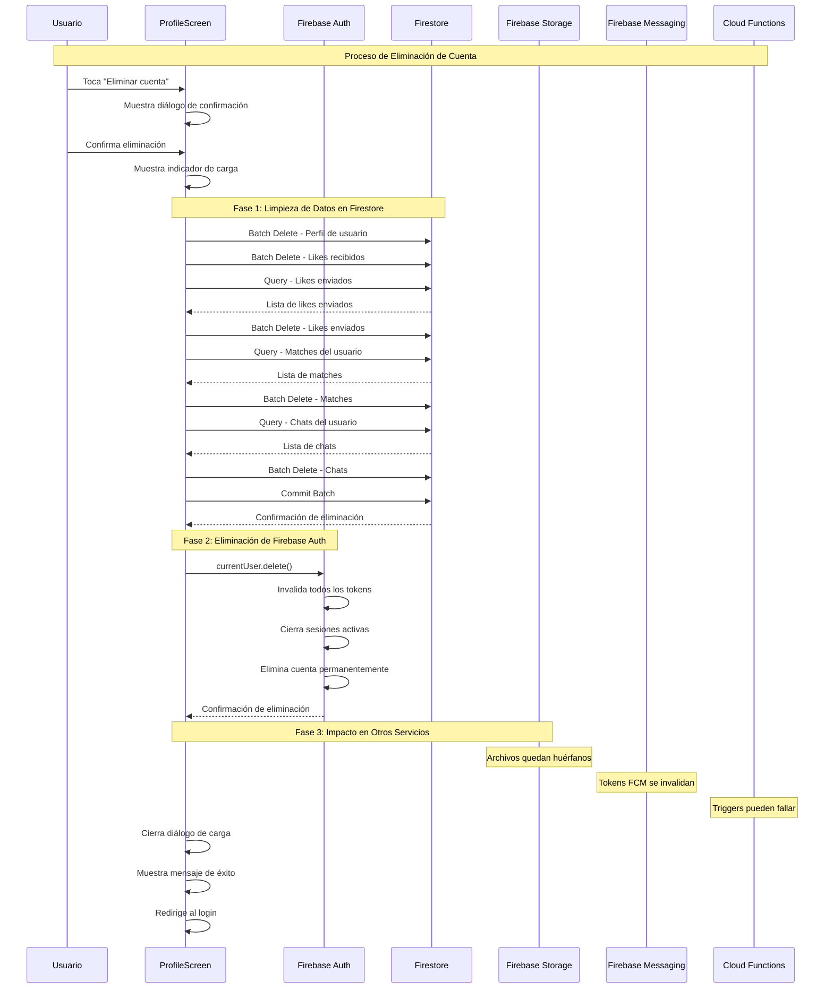
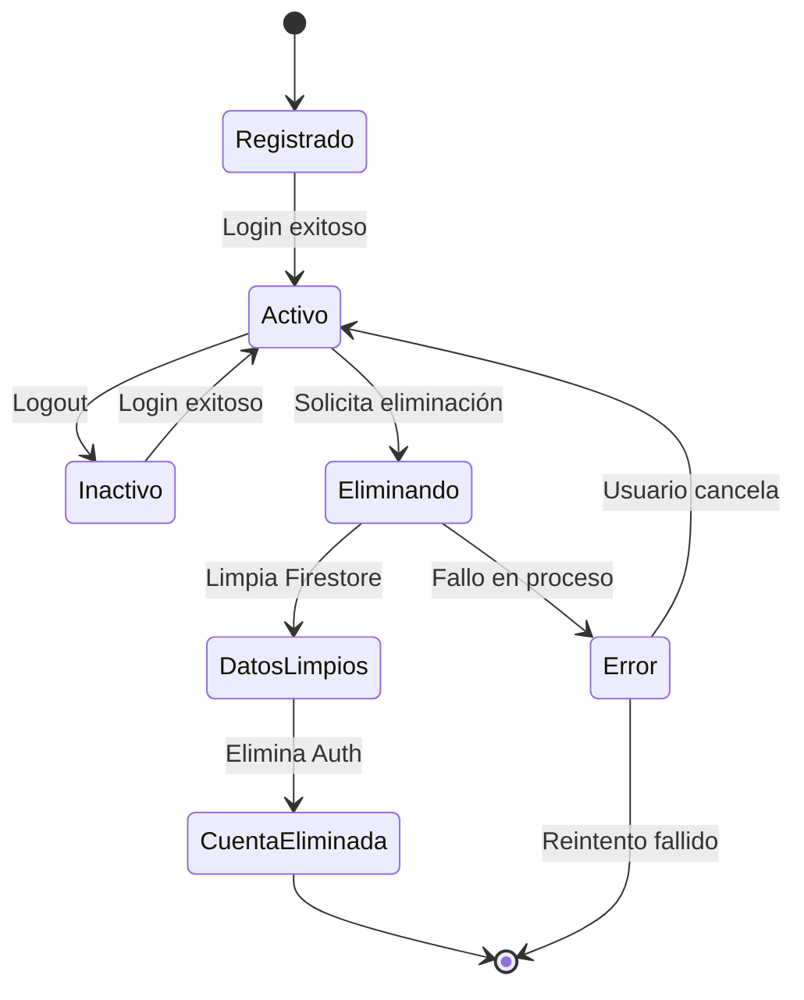
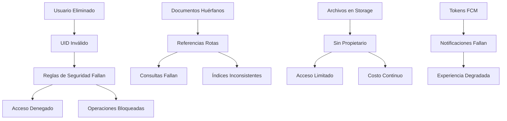

# Diagrama UML - Eliminación de Cuenta en Firebase

## Diagrama de Secuencia



## Diagrama de Clases - Impacto en la Base de Datos

```mermaid
classDiagram
    class User {
        +String uid
        +String name
        +String email
        +DateTime birthDate
        +String description
        +List~String~ photoUrls
        +List~Map~ topSongs
        +String favoriteDrink
        +String sign
    }

    class LikeReceived {
        +String userId
        +List~Map~ likes
        +DateTime lastUpdated
    }

    class LikeSent {
        +String id
        +String fromUserId
        +String toUserId
        +DateTime timestamp
        +String message
    }

    class Match {
        +String id
        +List~String~ participants
        +DateTime createdAt
        +String status
    }

    class Chat {
        +String id
        +List~String~ participants
        +DateTime lastMessage
        +String lastMessageText
    }

    class FirebaseAuth {
        +User currentUser
        +deleteUser()
        +signOut()
    }

    class Firestore {
        +CollectionReference users
        +CollectionReference likes_received
        +CollectionReference likes_sent
        +CollectionReference matches
        +CollectionReference chats
        +batch()
        +commit()
    }

    User ||--o{ LikeSent : "envía"
    User ||--o{ Match : "participa"
    User ||--o{ Chat : "participa"
    User ||--|| LikeReceived : "tiene"
    
    FirebaseAuth ||--|| User : "autentica"
    Firestore ||--|| User : "almacena"
    Firestore ||--|| LikeReceived : "almacena"
    Firestore ||--|| LikeSent : "almacena"
    Firestore ||--|| Match : "almacena"
    Firestore ||--|| Chat : "almacena"
```

## Diagrama de Estados - Ciclo de Vida del Usuario



## Impacto en Reglas de Seguridad



## Recomendaciones de Limpieza

1. **Eliminar archivos de Storage** asociados al UID
2. **Limpiar referencias** en otros documentos
3. **Actualizar índices** de Firestore
4. **Revisar reglas de seguridad** para casos edge
5. **Monitorear costos** de Storage por archivos huérfanos
