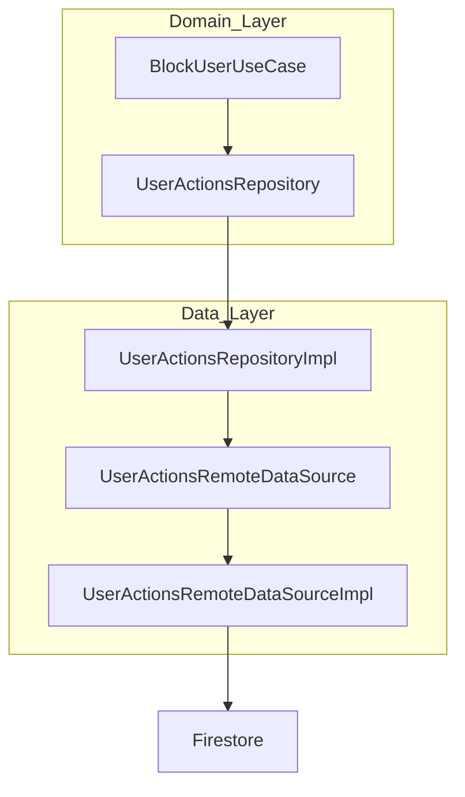

# User Actions: Bloquear Usuario

Este documento explica la función de cada archivo creado para la lógica de bloquear usuario en la arquitectura limpia, y cómo interactúan entre sí.

---

## Diagrama de Flujo



---

## Explicación de cada archivo

### 1. `domain/repositories/user_actions_repository.dart`
Define la abstracción del repositorio para las acciones de usuario. Declara el método:
```dart
Future<void> blockUser({required String blockerId, required String blockedId});
```
Esto permite desacoplar la lógica de dominio de la implementación concreta.

### 2. `domain/usecases/block_user_usecase.dart`
Caso de uso que representa la acción de bloquear un usuario. Recibe el repositorio abstracto y lo utiliza para ejecutar la acción:
```dart
Future<void> call({required String blockerId, required String blockedId})
```

### 3. `data/repositories/user_actions_repository_impl.dart`
Implementación concreta del repositorio. Recibe un datasource remoto y delega la acción de bloquear usuario:
```dart
Future<void> blockUser({required String blockerId, required String blockedId})
```

### 4. `data/datasources/user_actions_remote_datasource.dart`
Define la abstracción y la implementación concreta del datasource remoto. Aquí se realiza la interacción real con Firebase Firestore:
```dart
Future<void> blockUser({required String blockerId, required String blockedId})
```
La implementación (`UserActionsRemoteDataSourceImpl`) guarda el bloqueo en la ruta:
```
/users/{blockerId}/blocked/{blockedId}
```
con un timestamp.

---

## Resumen de la interacción
1. El caso de uso (`BlockUserUseCase`) es llamado desde la capa de presentación o lógica de aplicación.
2. El caso de uso llama al método del repositorio abstracto.
3. El repositorio concreto delega la acción al datasource remoto.
4. El datasource remoto impacta en Firestore, guardando el bloqueo.

---

Este flujo permite mantener el código desacoplado, testeable y escalable, siguiendo buenas prácticas de arquitectura limpia. 